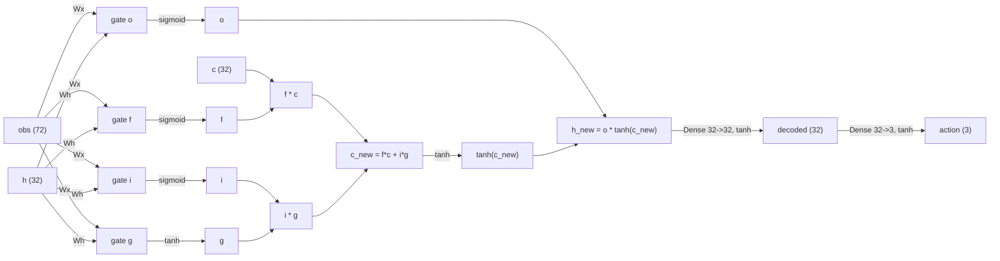

# Neural Network Architecture

This document describes the policy network that runs on the EV3, how it
is quantized, and how it maps onto `embedded-nn`'s kernels. The
single source of truth for the dimensions below is
[`tools/quantize_export/network_spec.py`](../tools/quantize_export/network_spec.py)
(Python/training side) and
[`firmware/src/config.rs`](../firmware/src/config.rs) (Rust/inference
side) — both must be kept in sync.

## Overview

The network is a small recurrent (LSTM) policy: a single hidden state
carries memory across control ticks (needed because the robot only gets a
partial, noisy view of the world each tick — a pure feed-forward network
was ruled insufficient). It takes the current sensor reading plus the
previous action as input and outputs the next action directly; there is
no separate value/critic network on-device (the critic only exists during
training).

`c_new` and `h_new` are written back into the persistent state and reused
on the next tick.

## Inputs (72 values)

| Feature | Dim | Source | Notes |
|---|---|---|---|
| `depth_scan` | 64 | VL53L8CX 8x8 zone ranging | Distance in meters per zone, no downsampling. |
| `yaw_sincos` | 2 | Gyro heading angle | `sin`/`cos` of yaw, avoids the ±π wrap-around a raw angle would cause. |
| `yaw_rate` | 1 | Gyro angular rate | Radians/second. |
| `wheel_deltas` | 2 | Drive motor encoders | Relative rotation *since the last tick* (not absolute position or velocity) — matches what the real `TachoMotor` position feedback provides. |
| `last_action` | 3 | Previous network output | Fed back for smoother control (standard sim2real trick). |

## Outputs (3 values, all tanh-bounded to [-1, 1])

| Output | Meaning |
|---|---|
| `wheel_left` | Left drive motor speed command. |
| `wheel_right` | Right drive motor speed command. |
| `kick_trigger` | Thresholded on-device (>0.5) to fire the kicker motor; not a continuous torque. |

## Layers and parameter count

The LSTM operates **directly on the raw observation** (no separate
encoder stage) with a small hidden size, followed by a Dense+Tanh
"decoder" and a Dense+Tanh action head. This matches `rsl_rl`'s stock
`ActorCriticRecurrent` structure (RNN on raw obs → actor MLP as decoder →
action), so training needs no custom actor-critic class.

| Layer | Shape | Parameters |
|---|---|---|
| Gate i: `Wx` (obs→hidden, w/ bias) | (32, 72) + (32,) | 2,336 |
| Gate i: `Wh` (hidden→hidden, no bias) | (32, 32) | 1,024 |
| Gate f: `Wx` + `Wh` | same shapes | 3,360 |
| Gate g: `Wx` + `Wh` | same shapes | 3,360 |
| Gate o: `Wx` + `Wh` | same shapes | 3,360 |
| Decoder (hidden→32, w/ bias) | (32, 32) + (32,) | 1,056 |
| Action head (32→3, w/ bias) | (3, 32) + (3,) | 99 |
| **Total** | | **14,595** |

At int8 weights + int64 bias this is roughly **14.6 KB of flash** for
weights plus a few KB for the (much smaller number of) bias values — well
within an EV3's storage budget.

### Why split `Wx`/`Wh` instead of concatenating `[obs, h]`?

A naive LSTM cell concatenates the input and the hidden state into one
vector and runs a single matrix multiply per gate. This project instead
computes `Wx @ obs` and `Wh @ h` as two **separate** fully-connected
layers, then combines them with `elementwise_add_s16`. This is necessary
because `obs` and `h` live at different quantization scales (`obs` is a
physical quantity like meters; `h` is a bounded `tanh`/`sigmoid` output),
and `embedded-nn`'s `fully_connected_s16` only supports a single input
scale per call. `elementwise_add_s16` natively supports two
independently-scaled inputs, so this design avoids any scale-matching
hack — and it happens to match PyTorch's `nn.LSTMCell` internal weight
layout exactly, which simplifies importing a trained checkpoint.

## Quantization scheme (Q15 / embedded-nn)

The network runs entirely on fixed-point integer math — no floating-point
instructions are needed on the inference hot path, which matters because
the EV3's ARMv5TEJ CPU has no FPU.

- **Weights**: int8, symmetric per-tensor scale.
- **Biases**: int64 (required by `embedded_nn::fully_connected_s16`).
- **Activations**: int16 throughout.
- **Bounded activations** (anything after a `tanh`/`sigmoid`) use a fixed
  Q0.15 scale (`raw / 32768.0`) — no calibration needed, since the
  mathematical range is always exactly known.
- **Unbounded activations** (raw observation, gate pre-activation logits,
  cell state, decoder/action logits) use a scale calibrated from a
  recorded rollout, chosen so it is an exact power of two compatible with
  `sigmoid_s16`/`tanh_s16`'s fixed Q3.12 input convention (see
  `tools/quantize_export/quantize.py::pow2_activation_scale`).
- Combining tensors at different scales (`Wx@obs + Wh@h`, and `f*c + i*g`)
  is done via `elementwise_add_s16`'s per-input multiplier/shift, computed
  with the same "TFLite `QuantizeMultiplier`" fixed-point decomposition
  `embedded-nn` itself uses internally.

The exact multiplier/shift math (including an `embedded-nn`-specific
`>> 15` accumulator quirk that isn't documented anywhere and was found by
probing the crate directly) is implemented in
[`tools/quantize_export/quantize.py`](../tools/quantize_export/quantize.py)
and mirrored in [`firmware/src/policy.rs`](../firmware/src/policy.rs).

## Mapping to `embedded-nn` kernels

| Network operation | `embedded-nn` function |
|---|---|
| Any Dense/Linear layer | `fully_connected::fully_connected_s16` |
| Combining `Wx@obs` + `Wh@h`, and `f*c` + `i*g` | `basic_math::elementwise_add_s16` |
| `f*c`, `i*g`, `o*tanh(c)` | `basic_math::elementwise_mul_s16` |
| Input/forget/output gate activation | `activations::sigmoid_s16` |
| Cell-candidate gate, cell-state, decoder, action activation | `activations::tanh_s16` |

There is no built-in LSTM operator in `embedded-nn` v0.2.1, so the cell is
assembled by hand from these primitives — see `firmware/src/policy.rs` for
the full forward pass.

## Performance

A dedicated benchmark (`firmware/src/bin/policy_bench.rs`) runs the
network on synthetic observations and measures wall-clock latency. Under
`qemu-arm-static` (ARM instruction emulation, not cycle-accurate to real
silicon but a useful functional proxy), the worst-case observed latency
was ~0.2 ms against a 20 ms (50 Hz) budget — roughly a 100x margin. See
the top-level `README.md` for how to run this yourself.
